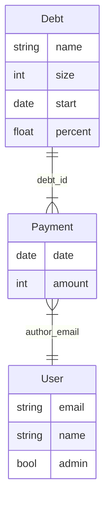

# Калькулятор задолженности

Клиент-серверное приложение для хранения информации о долгах в форме кредита:

- Список долгов/кредитов
- История платежей
- Расчет предстоящих платежей

## Платформа

FastAPI + Vue.js

## Структура данных

